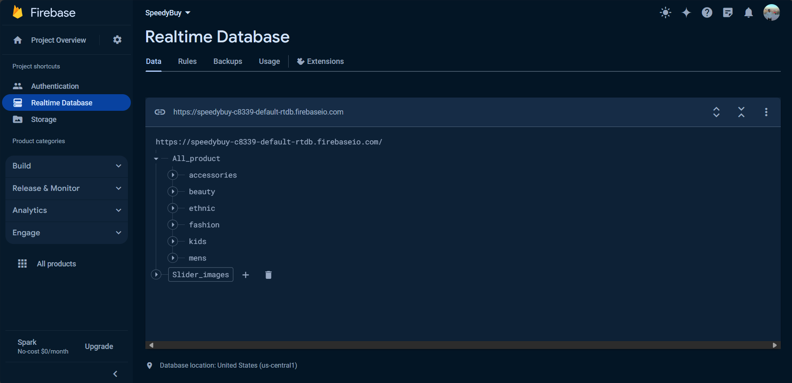
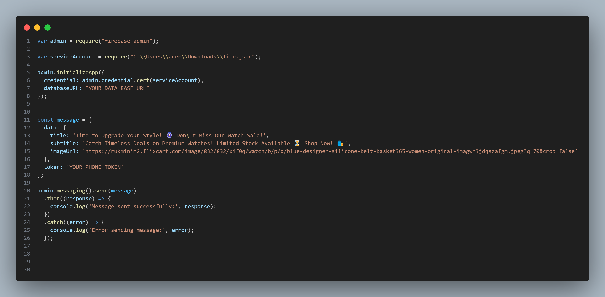

# SpeedyBuy is a Ecommerce app

Intro
------
                   

Log in page
------
                               

Sign up with email
------
                                 

Sign up with google
------
                   

Dashboard
------
                                 
                        
                     

Category
------
                   
                

Notification 
------
                   

Firebase  
------

   
 

    
